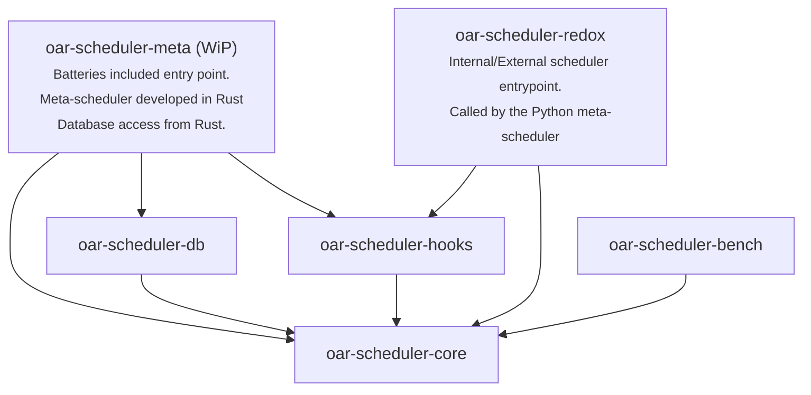

# Overview

This repository is a Rust implementation of the scheduler of the [OAR3 resource and job manager for cluster](https://github.com/oar-team/oar3).

oar-scheduler-redox fully re-implements the scheduling algorithm of OAR3, including all of its features.

- In external mode, it can be used as a drop-in replacement of the original Python scheduler.
- In internal mode (job in/job out), some parts of the meta-scheduler are developed in Rust, and you should use the Python OAR3
  branch [redox](https://github.com/oar-team/oar3/tree/redox) since significant changes have been made to the Python meta-scheduler to support this
  mode.

This Rust implementation is 10 to 100 times faster than the original Python implementation:

|                                                                    Python Scheduler                                                                    |                                               Rust Scheduler called from Python (Release maturin build)                                                |
|:------------------------------------------------------------------------------------------------------------------------------------------------------:|:------------------------------------------------------------------------------------------------------------------------------------------------------:|
|  |  |

# Crates

[`oar-scheduler-redox`](/oar-scheduler-redox) is the Python entrypoint of this Rust scheduler, but under the hood, the project is composed of six
crates, allowing us to benefit from a low-coupling modular architecture.

The crate [`oar-scheduler-meta`](/oar-scheduler-meta), still a work in progress, aims to provide a full python-independent meta-scheduler
implementation in Rust.

Here is the DAG of the dependencies between the crates:

Each crate has its own README with full documentation:

- [oar-scheduler-core](/oar-scheduler-core): core scheduling algorithms and data models.
- [oar-scheduler-hooks](/oar-scheduler-hooks): hooks system allowing sysadmins to code plugins in Rust.
- [oar-scheduler-db](/oar-scheduler-db): database integration for the meta-scheduler.
- [oar-scheduler-bench](/oar-scheduler-bench) (cli entrypoint): benchmarking framework working with both Rust and Python schedulers.
- [oar-scheduler-redox](/oar-scheduler-redox) (maturin entrypoint): Python bindings to integrate the Rust scheduler into OAR3.
- [oar-scheduler-meta](/oar-scheduler-meta) (cli entrypoint): work in progress crate to provide a full meta-scheduler implementation in
  Rust.

# Roadmap

### Scheduler ([`oar-scheduler-core`](/oar-scheduler-core))

- [x] Basic scheduler, advance reservation & platform setup
- [x] Hierarchies request support
- [x] Quotas support
- [x] Timesharing support
- [x] Job dependencies support
- [x] Job container support
- [x] Placeholders support
- [x] Temporal quotas support
- [x] Job sorting on the Rust side.
- [ ] Envelopes support

### Plugins support ([`oar-scheduler-hooks`](/oar-scheduler-hooks))

- [x] Rust hooks support (plugins developed in Rust)
- [ ] Python hooks support (plugins developed in Python, called from Rust)

### Database support ([`oar-scheduler-db`](/oar-scheduler-db))

- [x] Building a database framework around sqlx and sea-query supporting both PostgreSQL and SQLite for tests (schema must be dynamic).
- [x] Support CRUD operations needed for Platform initialization (resources and jobs fetching).
- [x] Support CRUD operations needed for job and moldables updates.
- [ ] Implement new CRUD operations as needed by the meta-scheduler.

### Benchmarking ([`oar-scheduler-bench`](/oar-scheduler-bench))

- [x] Benchmarking framework
- [x] Calling the Python scheduler from the benchmarking framework
- [x] Macros for function time measurement ([auto_bench_fct](https://crates.io/crates/auto_bench_fct))

### Python integration ([`oar-scheduler-redox`](/oar-scheduler-redox))

- [x] Expose the Rust scheduler as a Python library
- [x] Support external mode (convert platform: jobs, config, resources set, etc.)
- [x] Support internal (mixed) mode (implement some parts of the meta-scheduler into Rust, and edit the Python meta-scheduler to add the integration)

### Standalone meta-scheduler ([`oar-scheduler-meta`](/oar-scheduler-meta))

- [x] Meta-scheduler base structure with core features.
- [x] Minimal meta-scheduler (no gantt visualization, no node management, only TOODs marked as `(MVP REQUIRED)`).
- [ ] Adding more tests to test the whole meta-scheduler.
- [ ] Full meta-scheduler
- [ ] Remove the usage of gantt tables `gantt_jobs_resources` and `gantt_jobs_predictions` as they add an intermediary step with heavy
  database requests. In a full Rust implementation, this is a useless overhead.

# License

This project is licensed under the GNU General Public License v3.0 (GPL-3.0).
See the [LICENSE.md](LICENSE.md) file for details.
