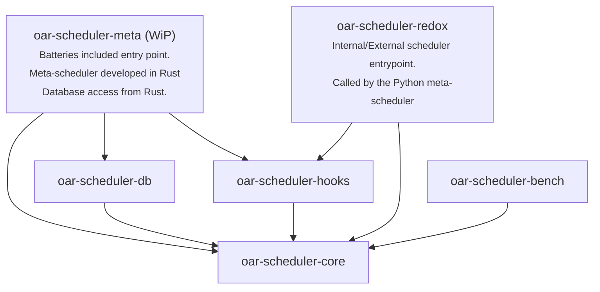

# Overview

This repository is a Rust implementation of the scheduler of the [OAR3 resource and job manager for cluster](https://github.com/oar-team/oar3).

oar-scheduler-redox fully re-implements the scheduling algorithm of OAR3, including all of its features.
- In external mode, it can be used as a drop-in replacement of the original Python scheduler.
- In internal mode (job in/job out), some parts of the meta-scheduler are developed in Rust, and you should use the OAR3
  branch [redox](https://github.com/oar-team/oar3/tree/redox) since significant changes have been made to the meta-scheduler to support this mode.

oar-scheduler-redox is 10 to 100 times faster than the original Python implementation :

|                                                          Python Scheduler                                                          |                                     Rust Scheduler called from Python (Release maturin build)                                      |
|:----------------------------------------------------------------------------------------------------------------------------------:|:----------------------------------------------------------------------------------------------------------------------------------:|
|  |  |

# Roadmap

### Scheduler (`oar-scheduler-core`)

- [x] Basic scheduler, advance reservation & platform setup
- [x] Hierarchies request support
- [x] Quotas support
- [x] Timesharing support
- [x] Job dependencies support
- [x] Job container support
- [x] Placeholders support
- [x] Temporal quotas support
- [x] Implement job sorting on the Rust side.
- [ ] Envelopes support

### Benchmarking (`oar-scheduler-bench`)

- [x] Benchmarking framework
- [x] Calling the Python scheduler from the benchmarking framework
- [x] Macros for function time measurement ([auto_bench_fct](https://crates.io/crates/auto_bench_fct))

### Python integration (`oar-scheduler-redox`)

- [x] Expose the Rust scheduler as a Python library
- [x] Support external mode (convert platform: jobs, config, resources set, etc.)
- [x] Support internal (mixed) mode (implement some parts of the meta-scheduler into Rust, and edit the Python meta-scheduler to add the integration)

### Standalone meta-scheduler (`oar-scheduler-meta`)

- [ ] Develop the meta-scheduler fully in Rust

### Database support (`oar-scheduler-db`)

- [x] Demonstrate a usage of a database library allowing to query arbitrary column names (the resource table is customizable by the users).
- [ ] Support any CRUD operations integrated with `oar-scheduler-core::model`.

### Plugins support (`oar-scheduler-hooks`)

- [x] Rust hooks support (plugins developed in Rust)

# Crates Descriptions & Usage

## Dependency DAG



## Crate oar-scheduler-core

This crate is a Rust library that implements the core scheduling algorithms of OAR3. It also contains the data models.

## Crate oar-scheduler-db

This crate provide the integration with the OAR3 database using `sqlx` and `sea-query`.

## Crate oar-scheduler-meta

Work in progress crate allowing to run the meta-scheduler fully in Rust, including database access.
No Python bindings are required.

## Crate oar-scheduler-bench

This crate is used to benchmark the Rust and Python scheduler performance.
It provides sample workloads, mocking, python adapters, and a graphing
system to plot results.

### Running benchmarks

Configure the benchmarks in `main.rs` editing the initialization of the `BenchmarkConfig` struct.
Then, run with:

```bash
cargo run -p oar-scheduler-bench
```

or in release mode (not available for Python and RustFromPython targets)

```bash
cargo run -p oar-scheduler-bench --release
```

## Crate oar-scheduler-redox

This crate is a Maturin Python library exposing the `oar-scheduler-core` crate to Python.
It can be used by the OAR3 Python meta-scheduler instead of the legacy Python scheduler. Though the meta-scheduler implementation and database
requests stay in Python.

### Building the library and installing it in a virtual environment

First enable the virtual environment of OAR:

```bash
source /path/to/oar3/venv/bin/activate
```

Then, install the `maturin` tool if not already installed:

```bash
pip install maturin
```

Finally, build and install the library:

```bash
cd ./oar-scheduler-redox
maturin develop
```

Or, to build the library in release mode:

```bash
cd ./oar-scheduler-redox
maturin develop --release
```

### Usage in Python

You can use the library in internal mode, or in external mode, called mixed mode.
A full python implementation is available on the OAR3 branch [redox](https://github.com/oar-team/oar3/tree/redox).

In OAR3, the mixed mode is implemented to be used in replacement of the internal scheduler.
It delegates some parts of the meta-scheduling to this crate. Though all the database requests are done in Python.

External mode:

```python
import oar_scheduler_redox

oar_scheduler_redox.schedule_cycle_external(session, config, platform, now, queues)
```

Internal mode (mixed mode):

```python
import oar_scheduler_redox

redox_platform = oar_scheduler_redox.build_redox_platform(
  session, config, platform, now, scheduled_jobs
)
redox_slot_sets = oar_scheduler_redox.build_redox_slot_sets(redox_platform)
for active_queues in grouped_active_queues:
  oar_scheduler_redox.schedule_cycle_internal(
    redox_platform, redox_slot_sets, active_queues
  )
  for queue in active_queues:
    oar_scheduler_redox.check_reservation_jobs(
      redox_platform, redox_slot_sets, queue
    )
```

## Crate oar-scheduler-hooks

This crate allows sysadmins to define rust functions (hooks) that are called by the scheduler at specific points in the scheduling process, allowing
to overwrite default behavior.

As shown in the dependency tree, this crate should keep a fixed structure exposing the struct `Hooks` with a `pub fn new() -> Option<Self>` function,
and implementing the trait `HooksHandler`. This way `oar-scheduler-redox` will be able to initialize the struct and call a function of
`oar-scheduler-core` to register the hooks.

The `new` function of `Hooks` is called at the beginning of the process, and can return `None` to disable the hook system.
Hook functions return either a `bool` or an `Option<T>`. If `false` or `None` is returned, the default behavior is applied. If `true` or `Some(value)`
is returned, the default behavior is overridden.

### Available hooks

- `sort`: Overrides the job sorting algorithm.
- `assign`: Overrides the job assignment logic for a single job on a given slotset.
- `find`: Overrides the resources request evaluation logic.

Look at `oar-scheduler-core/hooks.rs` for more details on the available hooks and their usage.

### Creating custom hooks

Either clone the repository and edit directly the `oar-scheduler-hooks` crate, or create a new crate with the same structure as `oar-scheduler-hooks`,
and replace the `oar-scheduler-hooks` dependency in `oar-scheduler-redox/Cargo.toml` with your custom crate.

# Notes about edge cases and differences with the original Python scheduler

- The whole scheduling algorithm works with closed intervals, meaning that the start and end time of a job, slot, periodical quotas are all inclusive.
  If a slot goes from `t1` to `t2`, the next slot will start at `t2 + 1` (same as in the original Python oar scheduler).
- A job is subject to a single quota rule. The rule to be applied is the one that matches the job with the maximum specificity.
  If the job has two or more types and quotas are defined for booth types, the behavior is undefined.
- Container jobs are subject to quotas limitations, but they never increment the quotas counters.
- Container jobs don't anymore apply their time-sharing and placeholder attributes to their sub-slotset at is was an edge case with little use case.
- Inner jobs are not subject to quotas limitations. Quotas are only tracked for the slotset `default`.
- In periodical temporal quotas, when specifying a period overnight (e.g. `22:00-04:00 fri * *`), it will create two periods: one from `22:00` to
  `00:00` and another from `00:00` to `04:00`, **both on the same day**. The second period will not appear on saturday: it will rather apply to
  friday.
- Although the scheduler uses closed intervals, periodical and oneshot temporal quotas are configured using half-open intervals (`[start, end)`),
  meaning that a time interval defined in the configuration as `10:00-12:00` will be parsed by the code as a period from `10:00:00` (inclusive) to
  `11:59:59` (inclusive).
- This scheduler does not take into account the `QUOTAS_PERIOD` configuration variable. It only uses `QUOTAS_WINDOW_TIME_LIMIT` and adds the
  periodical quotas only up to the end of the week containing `now + QUOTAS_WINDOW_TIME_LIMIT`. Any quota-limited job trying to be scheduled after
  `now + QUOTAS_WINDOW_TIME_LIMIT` will not be scheduled and a warning will be logged (if temporal quotas are configured).

# License

This project is licensed under the GNU General Public License v3.0 (GPL-3.0).
See the [LICENSE.md](LICENSE.md) file for details.
