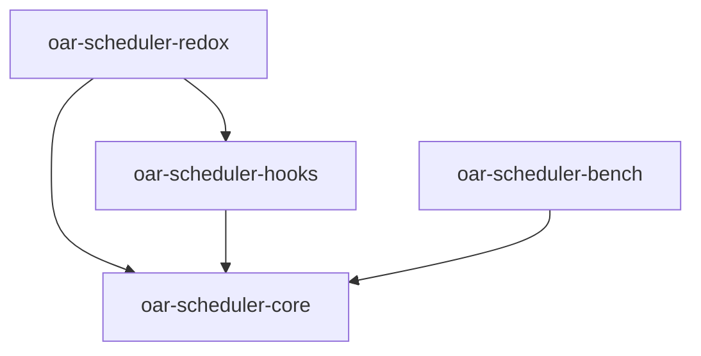

Rust scheduler implementation for OAR3

# Roadmap

### Scheduler (`oar-scheduler-core`)

- [x] Basic scheduler, advance reservation & platform setup
- [x] Hierarchies request support
- [x] Quotas support
- [x] Timesharing support
- [x] Job dependencies support
- [x] Job container support
- [x] Placeholders support
- [ ] Temporal quotas support
- [ ] Envelopes support

### Benchmarking (`oar-scheduler-bench`)

- [x] Benchmarking framework
- [x] Calling the Python scheduler from the benchmarking framework
- [x] Macros for function time measurement ([auto_bench_fct](https://crates.io/crates/auto_bench_fct))

### Python integration (`oar-scheduler-redox`)

- [x] Expose the Rust scheduler as a Python library
- [x] Support external mode (convert platform: jobs, config, resources set, etc.)
- [x] Support mixed mode (implement some parts of the meta-scheduler into Rust, and edit the Python meta-scheduler to add the integration)
- [x] Rust hooks support (plugins developed in Rust) 
- [ ] Support internal mode (convert slotset objects from Python to Rust and from Rust to Python)

# Crates & How to build/run

## Dependency graph


## Crate oar-scheduler-core

This crate is a Rust library that implements the core scheduler of OAR3 in Rust.

## Crate oar-scheduler-bench

This crate is used to benchmark the Rust and Python scheduler performance.
It provides sample workloads, mocking, python adapters, and a graphing
system to plot results.

### Running benchmarks

Configure the benchmarks in `main.rs` editing the initialization of the `BenchmarkConfig` struct.
Then, run with:

```bash
cargo run -p oar-scheduler-bench
```

or in release mode (not available for Python and RustFromPython targets)

```bash
cargo run -p oar-scheduler-bench --release
```

## Crate oar-scheduler-redox

This crate is a Maturin Python library exposing the oar-scheduler-core crate to Python.
It can be used by the OAR3 meta-scheduler instead of the legacy Python scheduler.

### Building the library and installing it in a virtual environment

First enable the virtual environment of OAR:

```bash
source /path/to/oar3/venv/bin/activate
```

Then, install the `maturin` tool if not already installed:

```bash
pip install maturin
```

Finally, build and install the library:

```bash
cd ./oar-scheduler-redox
maturin develop
```

Or, to build the library in release mode:

```bash
cd ./oar-scheduler-redox
maturin develop --release
```

### Usage in Python

You can use the library in internal mode, or in (almost) external mode, called mixed mode.
Look at the oar3 python source code to see how to use it. In oar3, the mixed mode is implemented to be used in replacement of the internal scheduler.

External mode:
```python
import oar_scheduler_redox

oar_scheduler_redox.schedule_cycle_external(session, config, platform, now, queues)
```

Internal mode (mixed mode):

```python
import oar_scheduler_redox

redox_platform = oar_scheduler_redox.build_redox_platform(
  session, config, platform, now, scheduled_jobs
)
redox_slot_sets = oar_scheduler_redox.build_redox_slot_sets(redox_platform)
for active_queues in grouped_active_queues:
  oar_scheduler_redox.schedule_cycle_internal(
    redox_platform, redox_slot_sets, active_queues
  )
  for queue in active_queues:
    oar_scheduler_redox.check_reservation_jobs(
      redox_platform, redox_slot_sets, queue
    )
```

## Crate oar-scheduler-hooks

This crate allows sysadmins to define rust functions (hooks) that are called by the scheduler at specific points in the scheduling process, allowing to overwrite default behavior.

As shown in the dependency tree, this crate should keep a fixed structure exposing the struct `Hooks` with a `pub fn new() -> Option<Self>` function, and implementing the trait `HooksHandler`. This way `oar-scheduler-redox` will be able to initialize the struct and call a function of `oar-scheduler-core` to register the hooks.

The `new` function of `Hooks` is called at the beginning of the process, and can return `None` to disable the hook system.
Hook functions return either a `bool` or an `Option<T>`. If `false` or `None` is returned, the default behavior is applied. If `true` or `Some(value)` is returned, the default behavior is overridden.

### Available hooks

- `assign`: Overrides the job assignment logic for a single job on a given slotset.
- `find`: Overrides the resources request evaluation logic.

Look at `oar-scheduler-core/hooks.rs` for more details on the available hooks and their usage.

### Creating custom hooks

Either clone the repository and edit directly the `oar-scheduler-hooks` crate, or create a new crate with the same structure as `oar-scheduler-hooks`, and replace the `oar-scheduler-hooks` dependency in `oar-scheduler-redox/Cargo.toml` with your custom crate.

# Notes

- A job is subject to a single quota rule. The rule to be applied is the one that matches the job with the maximum specificity.
  If the job has two or more types and quotas are defined for booth types, the behavior is undefined.
- Container jobs are subject to quotas limitations, but they never increment the quotas counters.
- Container jobs don't anymore apply their time-sharing and placeholder attributes to their sub-slotset at is was an edge case with little use case.
- In periodical temporal quotas, when specifying a period overnight (e.g. `22:00-04:00 fri * *`), it will create two periods: one from `22:00` to
  `00:00` and another from `00:00` to `04:00`, **both on the same day**. The second period will not appear on saturday: it will rather apply to
  friday.

# License

This project is licensed under the GNU General Public License v3.0 (GPL-3.0).
See the [LICENSE.md](LICENSE.md) file for details.
